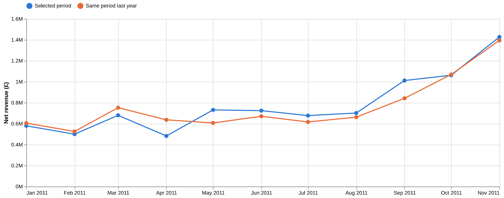
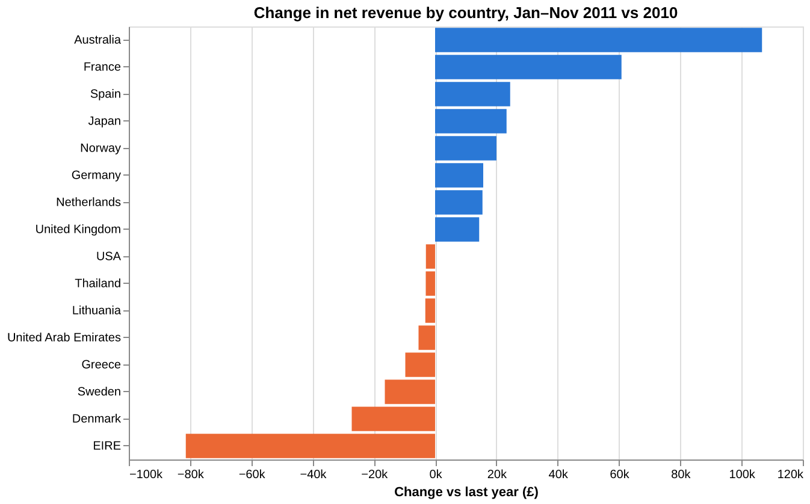
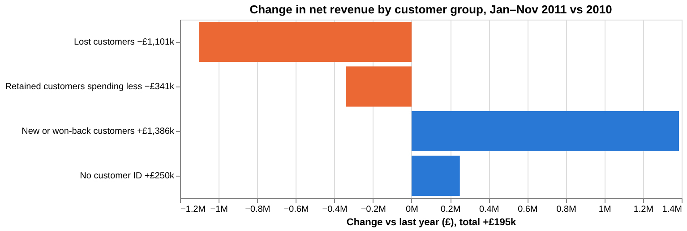

# Retail KPI dashboard (Streamlit)

> 🚧 **In progress.** The data prep, the tested KPI layer and the overview, drivers and customers tabs are done. More views are coming (see the roadmap).

An interactive KPI dashboard for a UK online gift wholesaler. It answers the questions a commercial manager asks every month: *Are we growing? Is it more orders or bigger orders? Are returns getting worse?* Every number is compared with the same period last year.

## Data
**UCI Online Retail II**: 1,067,371 invoice lines from a UK-based online retailer, Dec 2009 to Dec 2011.
Chen, D. (2019). *Online Retail II*. UCI Machine Learning Repository. https://doi.org/10.24432/C5CG6D. Licensed **CC BY 4.0**.
The raw file (~46 MB) is not committed; `scripts/download_data.py` fetches it.

## Data prep (`scripts/prepare_data.py`)
| Rule | Rows removed |
|---|---:|
| The two sheets overlap on 2010-12-01..09 (identical rows) | 22,523 |
| Exact duplicate rows | 11,812 |
| Non-product stock codes (postage, fees, adjustments) | 5,980 |
| Price ≤ 0 | 5,928 |

That leaves **1,021,128 clean lines**. Cancellations (17,914 lines) are kept as negative returns, so revenue can be shown net of returns.

**Keying errors.** Two huge orders were cancelled within minutes: 74,215 storage jars (£77,184, 18 Jan 2011) and 80,995 paper birdies (£168,470, 9 Dec 2011). They leave net revenue unchanged but inflate gross sales, AOV and the return rate, so the dashboard excludes such pairs by default (a checkbox, `cancelled_bulk_lines()` in `app/kpis.py`). Full log: [`results/prep_log.md`](results/prep_log.md).

## KPI definitions (`app/kpis.py`, unit-tested)
| KPI | Definition |
|---|---|
| Net revenue | Gross sales − returns |
| Orders | Distinct sale invoices |
| Avg order value (AOV) | Gross sales ÷ orders |
| Active customers | Distinct identified customers with a sale |
| Return rate | Returns ÷ gross sales |

## First look: Jan–Nov 2011 vs Jan–Nov 2010 (the dashboard's default view)
| KPI | 2011 | vs 2010 |
|---|---:|---:|
| Net revenue | £8,572,499 | +2.3% |
| Orders | 17,406 | −3.7% |
| Avg order value | £504 | +6.0% |
| Active customers | 4,167 | +1.0% |
| Return rate | 2.4% | down from 2.6% |

*Corrected on 2026-10-05:* the first version showed AOV +7.0% and a return rate up to 3.2%. Both came from the January keying error above. Without it, returns actually fell.



**So what?** Growth came from **bigger baskets, not more orders**: orders fell 3.7% while AOV rose 6.0%. The customer base was almost flat (+1.0%), so the business relies on existing accounts spending more. Returns are not a problem: they fell from 2.6% to 2.4% of gross sales once the keying error is removed. September was the stand-out month (~£1.0M vs ~£0.84M a year earlier); April was the weak spot.

## Drivers: what changed, Jan–Nov 2011 vs 2010
The **Drivers** tab splits the change in net revenue (+£195,333) by country or product, and splits AOV into lines per order × revenue per line.



- **Almost all growth came from overseas.** The UK, 84% of net revenue, grew only £14,365 (+0.2%). Non-UK markets added £180,968 (+15.1%), led by Australia (+£106,676, 4.6× its 2010 level) and France (+£60,838).
- **EIRE is the biggest drag** at −£81,382 (−25%), followed by Denmark (−£27,211) and Sweden (−£16,399).
- **Bigger baskets mean more lines, not bigger lines.** Lines per order rose 8.5% (24.2 → 26.3) while revenue per line fell 2.3% (£19.66 → £19.21). Customers are adding more products to each order, not buying more of each.
- **The range turns over fast.** 683 stock codes with no 2010 revenue brought £1.94M in 2011 (23% of net revenue); 939 codes that sold in 2010 brought nothing in 2011 (£0.60M the year before). The top gainers are new lines (rabbit night light +£57k, spotty bunting +£42k); the biggest decline is the white hanging heart T-light holder (−£46,818, −35%), still the #3 seller.

**So what?** Growth depends on a few export accounts and on new products, while the home market is flat. The commercial team should find out why EIRE fell (it was the largest export market in 2010), protect the Australian and French accounts, and keep the new-product pipeline going, because about a quarter of each year's revenue comes from lines that did not exist the year before.

## Customers: who kept buying, Jan–Nov 2011 vs 2010
The **Customers** tab shows new vs returning buyers, how many of last year's buyers came back, and a revenue bridge that splits the change in net revenue by customer group (the parts add up exactly; `revenue_bridge()` in `app/kpis.py`).



- **Retention is the weak spot.** Only 2,595 of the 4,127 customers who bought in Jan–Nov 2010 bought again in Jan–Nov 2011 (**62.9%**). The 1,532 who did not return had spent **£1.10M** the year before.
- **Customers who stayed spent less**: −£340,577 in total.
- **New and won-back customers filled the gap**: +£1.39M. 1,509 customers bought for the first time in 2011 and brought £1.34M of net revenue. Revenue without a customer ID (guest orders) rose £250k.
- **The EIRE decline is mostly one account.** Customer 14156 fell from £173,165 to £113,371 (−£59,793), about 73% of EIRE's −£81,382. It is also the single largest customer decline in the data.

**So what?** The flat headline (+2.3%) hides heavy churn: the business replaced about a third of its customers in a year. Acquisition is working, but winning back even a quarter of the £1.10M lost would add more than the year's whole growth. Account management should call the large accounts that lapsed or shrank (the dashboard lists them), starting with the top EIRE account.

*Caveat:* the data starts in Dec 2009, so "new customer" counts for 2010 periods are overstated (many existing accounts look new).

## How to run
```bash
python -m venv .venv && source .venv/bin/activate
pip install -r requirements.txt
python scripts/download_data.py      # ~46 MB
python scripts/prepare_data.py       # ~1.5 min, writes data/processed/transactions.parquet
pytest                               # KPI unit tests + app smoke test
streamlit run app/dashboard.py
python scripts/export_driver_chart.py    # optional: rebuild the README charts
python scripts/export_customer_chart.py
```
Use the filters to change the period and the country. YoY deltas are hidden when no data exists for the same period last year.

## Roadmap
- [x] Data prep + KPI layer + overview page (KPI tiles, monthly trend vs last year)
- [x] Drivers tab: country and product breakdowns, AOV split, keying-error filter
- [x] Customers tab: new vs returning, retention, revenue bridge by customer group
- [ ] Deployment notes for Streamlit Community Cloud, plus findings and recommendations
